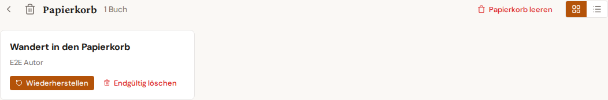

# Papierkorb und Wiederherstellung

Gelöschte Bücher und Artikel landen zunächst im **Papierkorb** und bleiben dort 90 Tage erhalten, bevor sie automatisch endgültig gelöscht werden. Innerhalb dieser Zeit lassen sie sich jederzeit wiederherstellen.

## Öffnen

Im Bücher- bzw. Artikel-Dashboard öffnet das Papierkorb-Symbol in der oberen rechten Ecke die Papierkorb-Ansicht. Ein kleiner Zähler-Badge zeigt, wie viele Einträge gerade im Papierkorb liegen.

## Aktionen

- **Wiederherstellen** — bewegt den Eintrag zurück ins Dashboard. Sofortige Aktion; kein Bestätigungsdialog.
- **Endgültig löschen** — entfernt den Eintrag unwiderruflich (Bestätigung erforderlich).
- **Papierkorb leeren** — löscht alle Einträge im Papierkorb auf einmal endgültig.

## Massen-Wiederherstellung

Beim Soft-Delete einer ganzen Auswahl zeigt das Dashboard direkt einen **Rückgängig**-Toast. Ein Klick darauf stellt den gesamten Satz in einem einzigen API-Aufruf wieder her (Single-Round-Trip). Ist der Toast bereits weggeklickt, lässt sich die Auswahl auch nachträglich im Papierkorb mit "Auswahl wiederherstellen" zurückholen.

## Auto-Löschung

Das 90-Tage-Limit lässt sich in **Einstellungen → Verhalten** ändern (1 bis 365 Tage) oder ganz abschalten. Ohne Auto-Löschung wachsen Papierkorb-Inhalte unbegrenzt — sinnvoll z. B. für Recherche-Projekte, die selten endgültig wegfallen.
