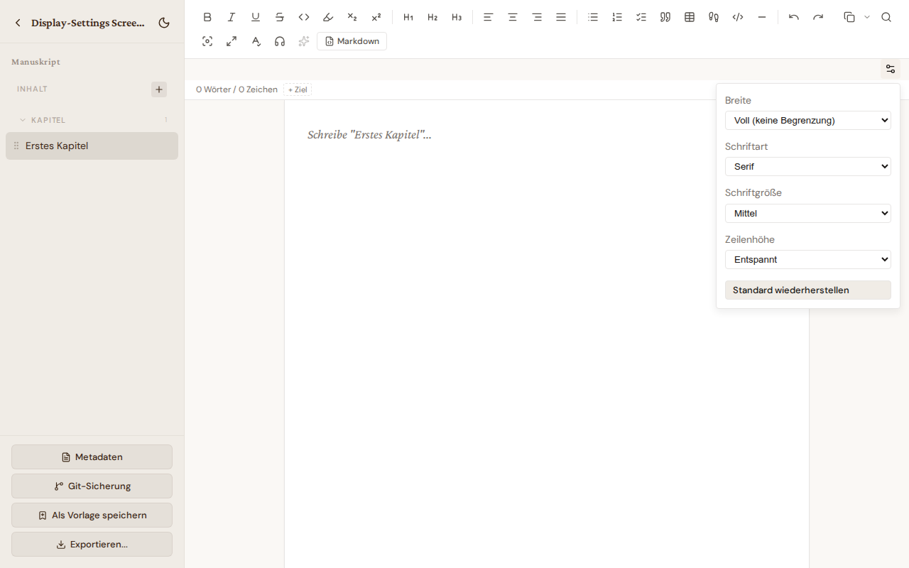

# Editor-Anzeige-Einstellungen

Über das Zahnrad-Symbol rechts neben der Editor-Toolbar lässt sich ein kleines Popover öffnen, in dem die Editor-Darstellung pro Gerät angepasst werden kann.

## Optionen

- **Breite** — Voll (keine Begrenzung), 900, 780 oder 680 Pixel. Engere Spalten lesen sich auf großen Monitoren angenehmer.
- **Schriftart** — Serif oder Sans-Serif.
- **Schriftgröße** — Klein, Mittel oder Groß.
- **Zeilenhöhe** — Kompakt, Normal oder Entspannt.

## Persistenz

Die Einstellungen werden in `localStorage` gespeichert (Schlüssel `bibliogon-editor-display-settings`). Sie gelten **pro Browser und Gerät**, nicht pro Konto oder pro Buch — eine Wahl auf dem Laptop verändert das Tablet nicht. Mit **Standard wiederherstellen** lassen sich alle vier Werte auf die Voreinstellung zurücksetzen.

Die Einstellungen wirken sowohl im Buch- als auch im Artikel-Editor — beide nutzen denselben Editor-Code.
