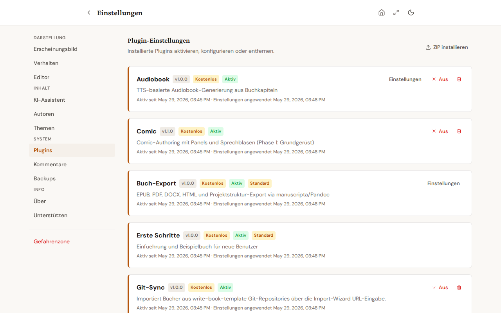

# Plugins - Übersicht

## Was sind Plugins?

Bibliogon ist modular aufgebaut. Der Kern der Anwendung umfasst die grundlegenden Funktionen: Bücher und Kapitel verwalten, den TipTap-Editor, Backup und Restore sowie die Benutzeroberfläche. Alle weitergehenden Funktionen wie Export, Grammatikprüfung, Übersetzung und Audiobook-Generierung sind als Plugins realisiert.

Plugins sind eigenständige Pakete, die über das PluginForge-Framework (basierend auf pluggy) geladen werden. Jedes Plugin registriert sich beim Start der Anwendung automatisch und stellt seine Funktionen über API-Endpunkte bereit. Plugins können von anderen Plugins abhängen, zum Beispiel baut das Audiobook-Plugin auf dem Export-Plugin auf.

## Verfügbare Plugins

Alle Plugins sind kostenlos und ohne Einschränkung nutzbar. Der Name in
Klammern ist die Kennung, unter der das Plugin in `plugins.enabled` und in der
`plugin.yaml` eines Plugin-ZIPs auftaucht.

- **A+ Content** (`aplus`) - Amazon-A+-Paket aus den Buchmetadaten: Kurzbeschreibung, drei Bullets, Header- und Drei-Bild-Module, geprüft gegen ein Regelwerk pro Sprache.
- **Audiobook** (`audiobook`) - Hörbuch aus den Kapiteln per Sprachsynthese, mit Engine- und Stimmwahl pro Buch.
- **Comics** (`comics`) - Comic-Seiten mit mehreren Panels, Sprechblasen und eigenem PDF-Rendering.
- **Export** (`export`) - EPUB, PDF, DOCX, HTML, Markdown, LaTeX und die Projektstruktur als ZIP.
- **Erste Schritte** (`getstarted`) - Onboarding und ein Beispielbuch zum Mitlesen.
- **Git-Sync** (`git-sync`) - Import aus einem Git-Repository und Abgleich in beide Richtungen.
- **Grammatik** (`grammar`) - Grammatik- und Rechtschreibprüfung über LanguageTool.
- **Hilfe** (`help`) - Diese Hilfe, die Tastenkürzel-Übersicht und die FAQ.
- **KDP** (`kdp`) - Amazon-KDP-Metadaten, Cover-Prüfung und Vollständigkeits-Check.
- **Kinderbuch** (`kinderbuch`) - Ein-Bild-pro-Seite-Layouts für Bilderbücher.
- **Lernset** (`learnset`) - Export eines Buchs als Lernset für adaptive-learner.
- **Medium-Import** (`medium-import`) - Importiert einen Medium-HTML-Export samt Publikationen und Herkunftsangaben.
- **MS-Tools** (`ms-tools`) - Stil-Checks, Text-Bereinigung und Textmetriken, mit Schwellwerten pro Buch.
- **Promotion** (`promotion`) - Portfolio-Übersicht über die Verkaufsformate eines Buchs: Status, Store-Links, ASIN.
- **Story-Bible** (`story-bible`) - Figuren-, Orts- und Handlungsdatenbank pro Buch, verknüpft mit Kapiteln und Seiten.
- **Übersetzung** (`translation`) - Übersetzung über DeepL oder LMStudio.

Welche dieser Funktionen in der Web-App ohne Desktop-Installation läuft, steht
in der Offline-Übersicht; manche brauchen ein Programm auf deinem Rechner und
sind im Browser deshalb mit einer Begründung deaktiviert statt versteckt.

## Plugin-Installation

Die mitgelieferten Plugins werden automatisch beim Start geladen. Drittanbieter-Plugins lassen sich als ZIP-Datei über Einstellungen > Plugins installieren. Die ZIP-Datei muss eine `plugin.yaml` und ein Python-Paket mit einer Plugin-Klasse enthalten. Nach dem Upload wird das Plugin in `plugins/installed/` extrahiert und beim nächsten Start registriert.

Ein Plugin liefert Server-Funktionen: API-Endpunkte, Hooks und seine Konfiguration. Die Bedienoberfläche dazu gehört zur Anwendung selbst und erscheint abhängig davon, welcher Buchtyp geöffnet ist und welche Plugins aktiv sind - der Comic-Editor etwa nur bei einem Comic-Buch. Ein Plugin bringt also keine eigenen Schaltflächen mit.

## Plugin-Verwaltung

In den Einstellungen unter "Plugins" siehst du eine Liste aller installierten Plugins mit Name, Version und Status. Plugins können aktiviert oder deaktiviert werden. Der Status jedes Plugins (aktiv, inaktiv) wird auf einen Blick angezeigt.

