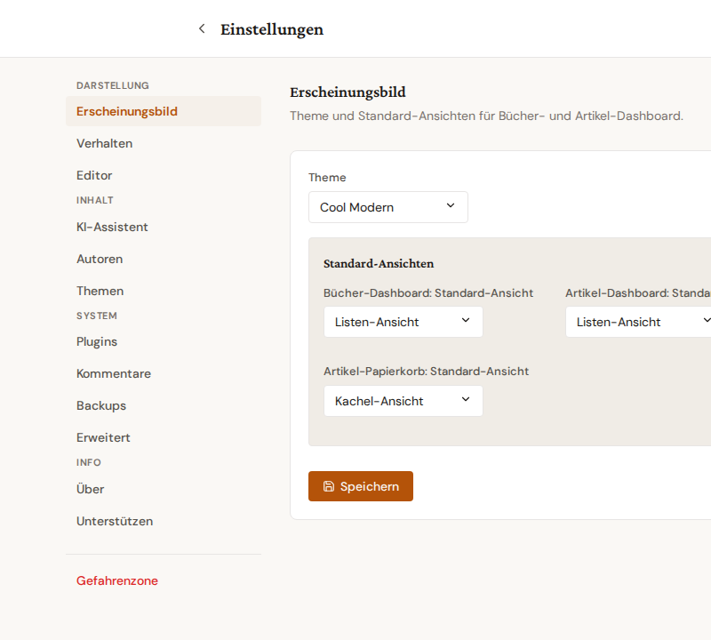

# Einstellungen-Navigation

Die Einstellungs-Seite ist in eine linke Sidebar aufgeteilt, in der jeder Tab nach Thema gruppiert ist. Die Sidebar bleibt links sichtbar; rechts daneben rendert der Inhalt des gerade aktiven Tabs. Anker-URLs (`?tab=...`) funktionieren weiterhin — Lesezeichen und Hilfedoku-Links landen ohne Anpassung am richtigen Punkt.

## Gruppen

- **Darstellung** — Erscheinungsbild, Verhalten, Editor.
- **Inhalt** — KI-Assistent, Autoren, Themen.
- **System** — Plugins, Kommentare, Backups, Erweitert.
- **Info** — Über und Unterstützen (sofern Spendenkonfiguration aktiv).
- **Gefahrenzone** — visuell separiert am unteren Ende, rotes Akzentfeld; siehe [Gefahrenzone](danger-zone.md).

## Mobile Ansicht

Unter 768 px Breite verschwindet die Sidebar, und ein Hamburger-Dropdown öffnet stattdessen die Tab-Liste. Die Gruppierung bleibt erhalten: zwischen den Gruppen gibt es Trennlinien im Popover.

## Tipps

- Die zuletzt aktive Tab-URL wird in der Adressleiste mitgeführt; ein Reload oder Zurück-Knopf landet wieder am selben Punkt.
- Alte Lesezeichen wie `?tab=author` oder `?tab=authors_database` werden automatisch zum konsolidierten `?tab=autoren` umgeleitet.
