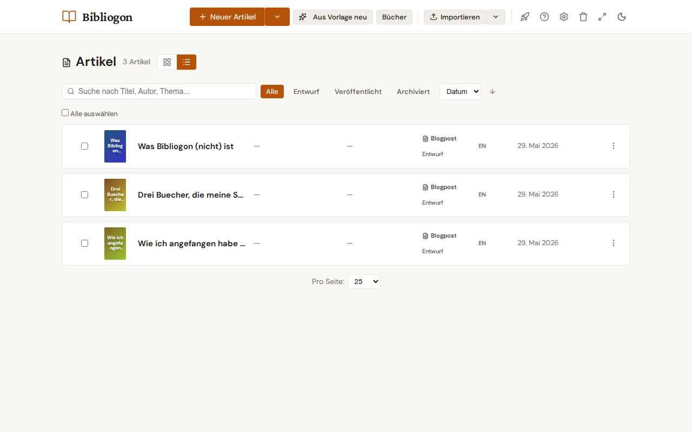

# Content types

Bibliogon supports 8 content types so you can capture every long-form
writing shape in the right structure. The type is picked at creation
and can be changed any time in the ArticleEditor.

## The 8 types at a glance

| Type | When to use | Type-specific fields |
|---|---|---|
| **Blog post** | The default for short to medium-length posts | — |
| **Tutorial** | Step-by-step guides | Difficulty level, prerequisites, estimated duration |
| **Review** | Critiques of works (book, product, film …) | Reviewed work, creator, rating 1-5 |
| **Essay** | Longer reflective prose | — |
| **Newsletter** | Recurring posts with issue numbers | Issue number, send date |
| **Interview** | Conversations with other people | Partner name + role |
| **Listicle** | List-based posts (Top 10, 5 tips …) | — |
| **Short story** | Short, self-contained narratives | — |

## Field visibility per type

Each type shows only the metadata fields that make sense for it, so
the editor sidebar stays focused. **Always shown** for every type:
title, content, status, subtitle, author, language and topic. The
**optional core fields** below appear per type:

| Core field | blogpost | tutorial | review | essay | newsletter | interview | listicle | short story |
|---|:-:|:-:|:-:|:-:|:-:|:-:|:-:|:-:|
| Tags | ✓ | ✓ | ✓ | ✓ | — | ✓ | ✓ | ✓ |
| Excerpt | ✓ | ✓ | ✓ | — | — | — | ✓ | — |
| SEO (title + description) | ✓ | ✓ | ✓ | — | — | — | ✓ | — |
| Canonical URL | ✓ | — | — | — | — | — | — | — |
| Featured image | ✓ | ✓ | ✓ | ✓ | — | ✓ | ✓ | — |

The visibility is configured in the single source of truth,
`backend/config/content-types.yaml` (`core_fields` per type), so it
stays consistent everywhere. Switching a type in the editor reveals
or hides the relevant fields immediately.

## Each type in detail

### Blog post
The default and most flexible type — short to medium posts on any
topic. Shows the full set of optional fields (Tags, Excerpt, SEO,
Canonical URL, Featured image), so it's also the right home for a
post first published elsewhere (set the Canonical URL).

### Tutorial
A step-by-step how-to. Type-specific fields: **difficulty level**
(beginner / intermediate / advanced), **prerequisites**, and
**estimated duration (minutes)**. Shows Tags, Excerpt, SEO and a
Featured image. Use it whenever readers follow along with steps.

### Review
A critique of a work. Type-specific fields: **reviewed work**, its
**author / creator**, and a **rating (1-5)**. Shows Tags, Excerpt,
SEO and a Featured image. Use it for book / product / film / album
reviews where the rating + reviewed-work metadata matter.

### Essay
Longer, reflective prose. No type-specific fields. Shows only Tags +
a Featured image — Excerpt, SEO and Canonical URL are hidden to keep
the focus on the writing rather than search snippets. Use it for
opinion or reflective pieces.

### Newsletter
A recurring issue. Type-specific fields: **issue number** and **send
date**. Shows none of the optional core fields — a newsletter is
distributed by email, so SEO snippets, excerpts and canonical URLs
don't apply. Use it for issues of a periodic publication.

### Interview
A conversation with someone. Type-specific fields: **interview
partner name** and **role**. Shows Tags + a Featured image. Use it
for Q&A or interview formats.

### Listicle
A list-based post (Top 10, 5 tips …). No type-specific fields. Shows
Tags, Excerpt, SEO and a Featured image — list posts tend to be
search-oriented, so the SEO fields stay. Use it for ranked or
enumerated content.

### Short story
A short, self-contained narrative. No type-specific fields. Shows
only Tags — fiction rarely needs SEO snippets, canonical URLs or
excerpts. Use it for fiction you want to keep separate from
non-fiction posts.

## Creating with a type

On the article dashboard, click the arrow to the right of the
**New Article** button. A menu shows every type except the default
(Blog post). Picking a type creates a new article of that type
directly.

A plain click on **New Article** creates a blog post — the most
common choice, so it skips the menu round-trip.

## Changing the type later

In the ArticleEditor, the right-hand sidebar shows an **Article
type** dropdown right under the Status field. Switching the type
resets the type-specific fields (e.g. changing from Tutorial to
Review clears the tutorial fields and reveals the review fields) and
re-applies the per-type field visibility above.

## Dashboard display

Every article card (grid view) and list row (list view) shows a
small badge with the type's icon and label. You can see at a glance
which articles are tutorials, reviews, etc. without opening the
editor.

