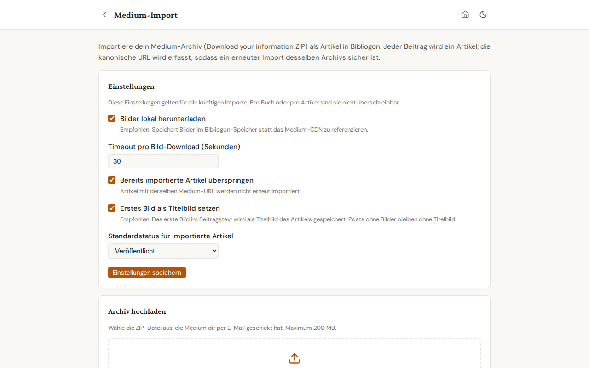

# Medium import

Bibliogon imports the entire Medium archive that you receive via "Download your information". Each post becomes a Bibliogon article, with provenance metadata and (optionally) locally-downloaded images.

## When to use it

- You are leaving Medium and want a structured local copy of every post.
- You moved to your own publication and want the full back catalogue searchable in Bibliogon.
- You want to keep writing in Bibliogon while still mirroring to Medium for reach.

## Getting your archive

1. On Medium, open **Settings → Security and apps → Download your information**.
2. Click **Download .zip**. Medium emails a link within minutes for small accounts and within hours for large ones.
3. Save the ZIP locally. Do **not** unpack it — Bibliogon reads the ZIP directly.

## Running the import

1. Open **Articles** in the side nav.
2. Click **Aus Medium importieren** (Import from Medium) in the toolbar.
3. The dedicated import page opens at `/articles/import/medium`. Adjust settings if needed (see below), then drop the ZIP into the upload zone or pick it via the file dialog. Maximum file size: 200 MB.

4. Click **Import starten** (Start import). The progress bar shows the upload percentage; once the upload completes, the panel switches to a server-processing indicator. A 200-article archive typically takes 30-60 seconds.
5. The result panel appears below with three sections: imported, skipped (already existed), errored. Imported article titles link directly to the Bibliogon article.

You can navigate away from the page during the import and come back to it. The result panel is lost when you navigate away — record any unexpected errors before leaving.

## Settings

Settings apply to every import; per-archive overrides are not supported.

- **Bilder lokal herunterladen** (Download images locally) — recommended. Bibliogon stores each image under your Bibliogon data directory instead of pointing at the Medium CDN. Disable only if you intentionally want CDN-hosted images.
- **Timeout pro Bild-Download (Sekunden)** (Per-image download timeout) — default 30. Raise on slow connections; the importer skips the image and continues if the timeout fires.
- **Bereits importierte Artikel überspringen** (Skip already-imported articles) — default on. Detection is by canonical Medium URL. Turn off only when you want to re-import a corrected archive on top of an existing one (see "Re-importing" below).
- **Standardstatus für importierte Artikel** (Default status for imported articles) — draft, published, or archived. Default is published since Medium posts are by definition published.
- **Erstes Bild als Titelbild setzen** (Use first image as featured image) — default on. The first image in the article body is assigned to the article's featured image (`Article.featured_image_url`). Posts without body images stay without a featured image; no error, no warning. Disable for authors who curate featured images manually.

This setting affects new imports only. To retroactively set featured images on articles you imported before this feature shipped, run `scripts/fix_medium_import_featured_images.py` (dry-run by default; pass `--apply` to write). Articles with a featured image already set are skipped — your manual curation is preserved.

## Re-importing the same archive

The importer is idempotent by canonical Medium URL. Running the same archive twice with the default settings produces zero changes — every post lands in the "skipped" section. To force a re-import (you fixed something in the archive, or you want to refresh image-download), turn off **Skip already-imported articles** before running again.

## What gets imported per post

- Title, subtitle (Medium "kicker"), publish date, canonical URL.
- **SEO defaults.** `seo_title` is set to the article title; `seo_description` is set to the Medium subtitle when present. Tags stay empty (Medium's HTML export strips them). All three are editable in the editor; the existing AI-generate button is the path to refine them. For articles without a subtitle, `seo_description` stays empty by design — no heuristic guesswork from body text.
- Body content, converted from Medium HTML to TipTap JSON (Bibliogon's editor format).
- **Publish date.** The original Medium publish date is captured during import and stored on the article's Publication row. The dashboard tile and article view display it as the article's date (preferred over `updated_at`) so a 2020 Medium article shows "Feb 2020", not the import timestamp. Native Bibliogon articles without a Publication keep their `updated_at` display.
- **Language**, auto-detected from the body text via `langdetect`. Medium HTML carries no language attribute, so detection runs over the body text statistically. Confident detections (≥0.85) are written to `Article.language`; ambiguous or very-short bodies fall back to `default_language` ("en"). You can change the language on any article in the editor; the importer never overwrites a manual change on re-import.
- Images, downloaded to local storage when the setting is on. The post body's image references are rewritten to point at the local copies.
- Provenance: an `ArticleImportSource` row records the source ZIP filename and the post's original HTML filename inside it. Useful for tracing an article back to its Medium origin.
- Publication membership: a `Publication` is created (or matched) for each Medium publication referenced in the archive, and the article is linked to it.

To retroactively detect language on articles imported before this feature shipped, run `scripts/fix_medium_import_language.py` (dry-run by default; pass `--apply` to write). Manually-corrected rows are skipped — the script only touches rows still at the historical `"en"` default.

To retroactively populate `seo_title` and `seo_description` on articles imported before commit `2062393`, run `scripts/fix_medium_import_seo.py` (dry-run by default; `--apply` to write). The script fills `seo_title` from `title` and `seo_description` from `subtitle` only where the field is currently empty — manual edits are preserved.

## What does NOT get imported

Medium's HTML export contains **only data you produced** —
your posts, your claps, your replies to other people's
articles, your bookmarks. By design it does **not** include:

- **Comments that other people wrote on your articles.**
  These are interactions on Medium's platform that belong
  to the commenters; they are not part of "your data"
  the way Medium's export defines it. The "Wow, I am
  very impressed" reply someone left on your article is
  not in the ZIP. If you need to archive replies to your
  articles, you would need to capture them manually
  before they age out on Medium itself; see follow-up
  `MEDIUM-COMMENT-MANUAL-ENTRY-01` in the backlog for a
  future manual-entry workflow.

  Note: your OWN replies to other people's articles ARE
  in the export (under `posts/` like any other post).
  These are what the comment-detection heuristic
  classifies into the `article_comments` table when
  `import_comments_mode=as_comments` is set.

- Drafts that were never published on Medium (Medium does not include them in the archive).
- Claps, follower lists, statistics.
- Custom CSS or formatting that Medium handles via inline styles outside the body element.
- Member-only paywall flags. All imported articles default to your chosen status; nothing carries the Medium-specific paywall metadata.

## Troubleshooting

- **"File too large" error**: the frontend hard-rejects ZIPs over 200 MB. For larger archives, split them by extracting and re-zipping in batches (the importer treats each ZIP independently).
- **An article landed under "errored" with a parse error**: the post HTML in the archive is malformed (a known edge case for very old Medium posts). The error message names the offending file. The other posts in the archive are not affected.
- **Images did not download**: check that **Bilder lokal herunterladen** is on, and that the per-image timeout is not too low for your connection. Articles import successfully even when images fail; image failures appear as warnings on the imported row.
- **Server processing takes much longer than 60 seconds**: large archives with image downloads can run for several minutes. The progress phase shows an indeterminate bar — leave the page open. Closing the browser tab cancels the import.

## Settings card in Settings → Plugins

The Settings → Plugins → Medium-Import card shows a pointer button that opens this dedicated page. Settings cannot be edited in the Settings tab; the dedicated page is the single source of truth.
