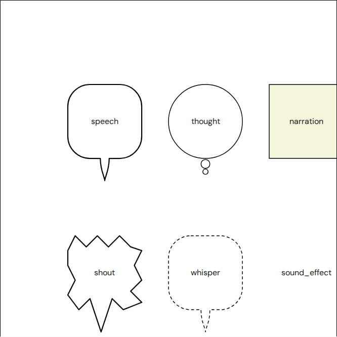
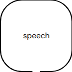
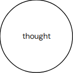
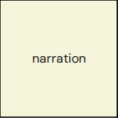
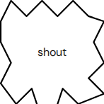
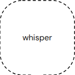
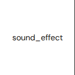

# Comic bubble types

Bibliogon's comic-book editor supports six bubble types. Each has its own visual shape, its own tail behaviour, and a typical use case. This page is the visual reference: what each type looks like, when to pick which, and what knobs you have.

All six bubble types are rendered as a single SVG path per bubble (outline + tail in one continuous shape) — no CSS-shape-plus-polygon-tail seam, no rasterisation surprises when you export the comic to PDF. The same path generator runs in the editor preview and in the WeasyPrint PDF walker, so what you see in the browser matches what KDP receives.

## At a glance

| Type | Shape | Tail | Default use |
|---|---|---|---|
| **Speech** | Rounded rectangle | Bezier S-curve | Spoken dialog |
| **Thought** | Ellipse (oval) | 1–3 shrinking circles drifting outward | Internal monologue |
| **Narration** | Rectangle | None — narrator voice doesn't point at a speaker | Caption boxes / setting the scene |
| **Shout** | 20-vertex star | One spike extended toward the speaker | Yelling, exclamation, sound that's still words |
| **Whisper** | Rounded rectangle, dashed outline | Bezier S-curve | Quiet aside, secret |
| **Sound effect** | No bubble — text only | None | "BAM!", "WHOOSH!", in-panel sound |

## The six types in detail

### Speech

The canonical comic-book bubble. A rounded rectangle with a curved bezier tail running to the speaker. The tail isn't a sharp triangle glued to the side — it flows out of the outline as part of the same shape, so the bubble looks like one organic figure rather than a shape with a triangle taped on.

Use it for any character dialog. The tail's direction, length, and on-edge position are configurable per bubble.

### Thought

An ellipse (oval) with a chain of shrinking circles drifting in the tail direction — the classic "thinking" cue. The oval body separates the thought from spoken dialog visually, and the circle chain reads as "this isn't being said, it's being thought." The chain shows 1 to 3 circles depending on how long the tail is (longer tail → more circles, smaller). Each circle is 60 % of the size of the one before it.

Use it for internal monologue, dreams, hypotheticals — anything the character isn't saying out loud.

### Narration

A rectangle with no tail. Narration boxes are the narrator's voice, not a character's, so they don't point at anyone. Even if the `tail_direction` field has a stored value from when the bubble was previously a different type, narration ignores it and always renders without a tail.

Default fill is parchment (`#f5f5dc`) — the conventional "this is the narrator, not a character" colour cue. Override the colour per bubble in the Properties panel.

Use it for "Meanwhile, in the basement…", time jumps, scene-setting.

### Shout

A 20-vertex jagged star — the visual cue for yelling, exclamation, anything loud. The tail isn't drawn as a separate element: the star's spike closest to the tail direction is extended outward, and the two spikes next to it form the natural base. The star absorbs the tail into its own outline.

Use it when the character is shouting, exclaiming, or making a loud impact word that's still recognisable speech. For pure sound effects ("BAM!"), pick **Sound effect** instead.

### Whisper

Same outline shape as Speech, but the stroke is dashed. The visual cue is "this is quiet" — the broken outline reads as a hushed voice.

Use it for asides, secrets, anything spoken under the breath. The bezier S-curve tail is identical to Speech — only the stroke style differs.

### Sound effect

No bubble at all — just the styled text floating in the panel. Heavy weight, italic, with a subtle text-shadow so the text reads even on busy panel artwork.

Use it for "BAM!", "WHOOSH!", "CRACK!" — onomatopoeia where the lettering itself is the illustration. Resize and reposition the text box like any other bubble; the difference is just that no outline draws.

## Configuring a bubble

Every bubble carries the same set of fields regardless of type:

- **Bubble type** — the picker at the top of the Properties panel. Changing the type re-renders the shape immediately; the text content carries over.
- **Anchor** (`x_pct` / `y_pct`) — where in the panel the bubble's centre sits, as a percentage. You can drag the bubble to set this visually; the slider in the Properties panel shows the same value.
- **Width** / **Height** (`width_pct` / `height_pct`) — bubble size as a percentage of the panel.
- **Tail direction** — one of 8 octants (N, NE, E, SE, S, SW, W, NW) or `none`. Ignored on Narration + Sound effect (which never draw a tail).
- **Tail position** (`tail_position_pct`) — where along the bubble's edge the tail starts. 0 = far corner; 100 = the other corner; 50 = middle of the edge.
- **Tail length** (`tail_length_px`) — how far the tail extends past the bubble's bbox. The thought chain uses this to decide how many circles to draw.

Per-bubble visual overrides (colour, border width, font, padding) live in the same Properties panel under **Style**.

## What survives the PDF export

The same SVG path that the editor draws gets embedded in the WeasyPrint-generated PDF. There's no separate "PDF rendering pipeline" that re-creates bubbles from scratch — the path string flows straight through. So:

- Visual quirks you see in the editor (a tail pointing the wrong way, a too-thin stroke) will appear in the PDF the same way.
- Fixing them in the editor fixes them in the PDF.
- The KDP-print profiles supported by `picture_book_pdf` (5 trim sizes + optional bleed marks) all work the same for comic books.

If the PDF render differs from the editor preview, that's a bug — please file an issue with both the editor screenshot and the PDF page.
