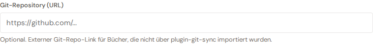

# Git repository URL

Each book can carry an optional **Git repository URL** in its metadata — useful for books maintained in an external Git repo (backup, version history, collaboration).

## Two modes

The field's behaviour depends on whether the book is managed by **plugin-git-sync**:

- **Managed** (mapping present) — the field is read-only and shows the canonical mapping URL. Manual edits would diverge from the round-trip, so the UI blocks editing. A short hint below the input explains the state.
- **Manual** (no mapping) — the field is a normal free-input URL that writes the `Book.repository_url` column. Handy for books that live on an external Git host but aren't (yet) synced through the plugin.

## Persistence

The URL is saved on the next save of the metadata tab. An empty field is stored as `NULL` — the field is optional, no book strictly needs a URL.
