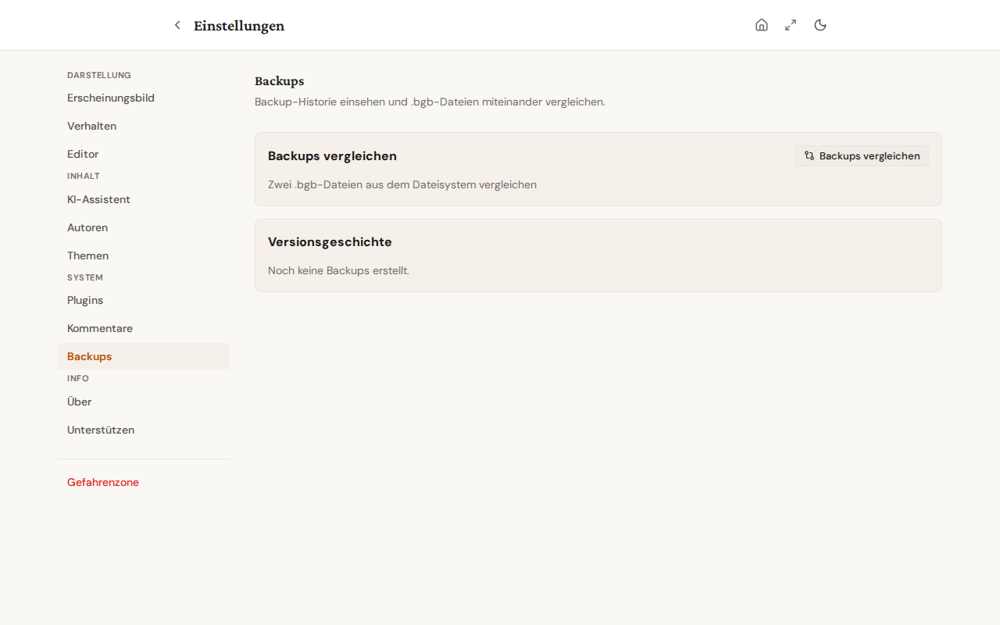

# Managing backups

The **Settings > Backups** tab is the central place for backup-related operations. It shows the version history of recent backups and lets you compare two backup snapshots against each other.

## Version history

When the tab opens, the recent backup history loads automatically (up to 20 entries). Each entry shows:

- **Date + time** of the backup
- **Action** (export, import, automatic backup)
- **Number of books** in the snapshot
- **Filename** of the backup file

## Delete individual entries

Each entry in the list carries a trash icon. Clicking it removes that single entry from the history — the underlying `.bgb` file on disk is NOT touched; only the history reference disappears.

Optimistic update: the entry disappears from the view immediately. If the server rejects the deletion, the list reappears with the entry in its original state and an error toast surfaces.

## Clear the entire history

The **Clear all entries** button removes every reference from the version history at once. A confirmation dialog warns before the action. Again, `.bgb` files on disk are NOT touched — only the history list gets emptied.

## Compare backups

The **Compare** button opens a dialog where you can pick two `.bgb` snapshots and diff them. The comparison shows per book:

- New books (present in only one snapshot)
- Deleted books (present in only one snapshot)
- Modified books (content hash differs)

Useful when you want to know what changed between two backup points — for example when hunting down an accidentally deleted chapter.

## Selective export

A full backup always carries everything. When you only need part of your data — say the articles for a single migration, or just your author profiles — use the **Selective export** card on the same Backups tab.

Tick the sections you want, then click **Export selected data**. The card groups the choices:

- **Content** — books (chapters and metadata travel with each book automatically), articles.
- **Master data** — authors / pen names, chapter labels.
- **Extra data** — story bibles / storyboards, writing history.
- **Configuration** — settings (theme, language, defaults).

Use **Select all** / **Deselect all** at the top to flip everything at once. Books always pull their chapters with them; the chapters checkbox is shown but locked on, so you cannot accidentally export a book without its text.

The result is a single JSON file with the same envelope as a full backup — only the sections you ticked are populated. To bring it back, open the [Import wizard](../import/git-url.md) and choose the JSON backup; the importer simply skips the sections that are absent. Because every read goes through the storage seam, the selective export works the same in the offline web app as on the desktop.

## Where the backup files live

The actual `.bgb` files are stored in the user-specific data directory:

- Linux / macOS: `~/.local/share/bibliogon/backups/`
- Windows: `%LOCALAPPDATA%\bibliogon\backups\`
- Docker (production): inside the named volume `bibliogon-data` under `/app/data/backups/`

Manual disk cleanup (for example to free up storage) happens directly on the file system; the version history is independent.

## Related topics

- [Danger Zone — system reset](danger-zone.md) — full reset of all data
- [Settings navigation](sidebar.md) — where the Backups tab sits
- [Git backup](../git-backup/basics.md) — alternative backup strategy via git remote
